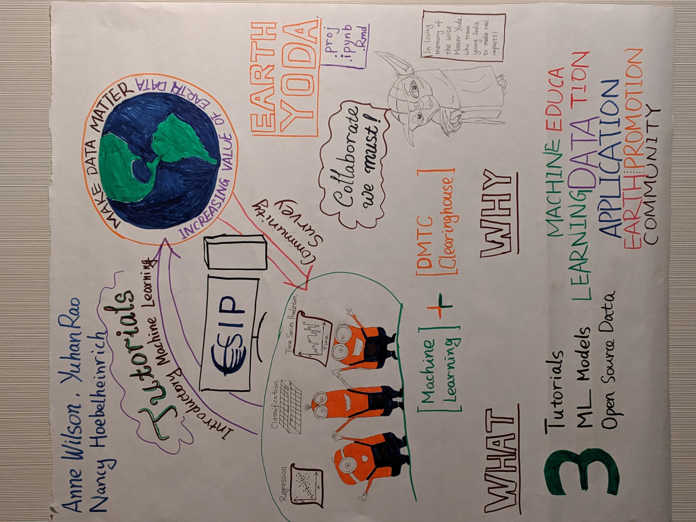

# ESIP Machine Learning Cluster Tutorials  

This is the repository for ESIP Machine Learning cluster training tutorials developed under the support of Funding Friday from 2019 ESIP Summer Meeting. The tutorial development also received advice from Anne Wilson (Ronin Institute, ESIP Machine Learning Cluster) and Nancy Hoebelheinrich (Knowledge Motifs, ESIP Data Management Training Clearinghouse). If you have any questions or suggestions regarding the tutorials, please contact [Yuhan (Douglas) Rao](mailto:yuhan.rao@gmail.com) of [North Carolina Institute for Climate Studies](https://ncics.org/people/douglas-rao/).  

## Instruction  

- To use R Notebook via Binder project, simply click on the  button on this page, you will be redirected to a virtual environment supported via [binder project](mybinder.org). You can then directly run/view the code in the virtual environment.  To use it locally, you will need to save a copy of the notebook to your local environment and install required R packages used in the notebook.  

- To use Jupyter notebook via Google Colaboratory, simply click on the  button on this page, you will be redirected to a virtual environment supported via [Google Colaboratory](https://colab.research.google.com/notebooks/intro.ipynb#scrollTo=GJBs_flRovLc). You will need to click on the _**Connect**_ button on the top right corner. To use it locally, you can save a copy of the notebook to your local environment and install required packages used in the notebook. An alternative way is to save a copy of the notebook to your own google drive and open it via Google Colab.   

## Classification  

(Last updated 2020-07-14)

- Using *R Notebook* in *RStudio* virtual environment -   
- Using *R Notebook* in *Jupyter* virtual environment -   
- Using *Jupyter notebook* in *Google Colaboratory* - 

## Regression

(Last updated 2020-07-14)

- Using *R Notebook* in *RStudio* virtual environment -   
- Using *R Notebook* in *Jupyter* virtual environment -   
- Using *Jupyter notebook* in *Google Colaboratory* (currently unavailable).

## Original Idea  

The idea of developing machine learning tutorials for Earth science community emerged after the ESIP Machine Learning Cluster business session during 2019 ESIP Summer Meeting in Takoma. So we workshoped this idea and participated in FUNding Friday during the summer meeting. With the support from ESIP FUNding Friday, we were able to make our first set of tutorials available. Below is our poster for the FUNding Friday 2019 with a lot of inspirations from the one and only Master Yoda and cheerful minions!

## Release History  

Beta version tested on 2020-07-01;  
First version (v.1.0) released on 2020-07-14; 
